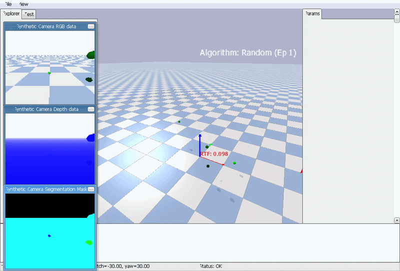
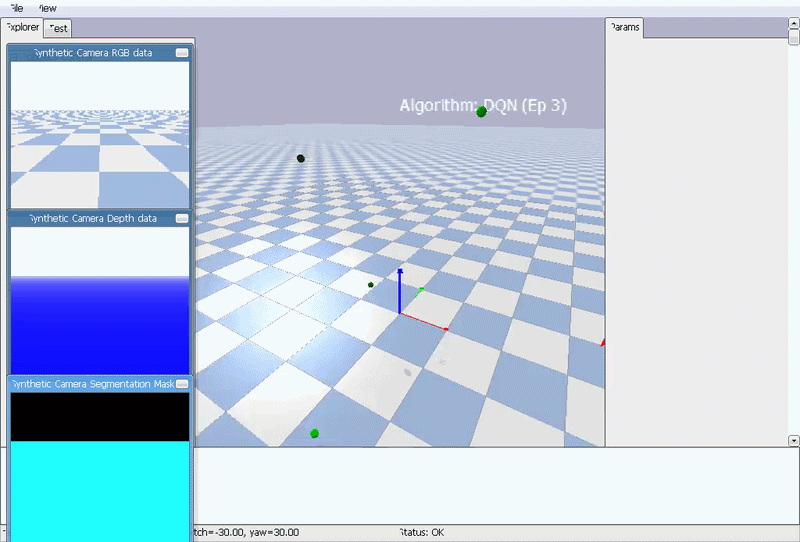
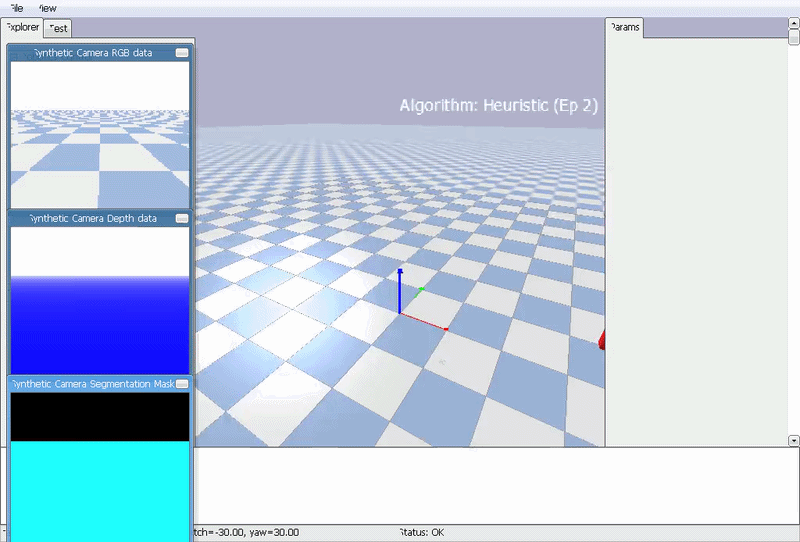
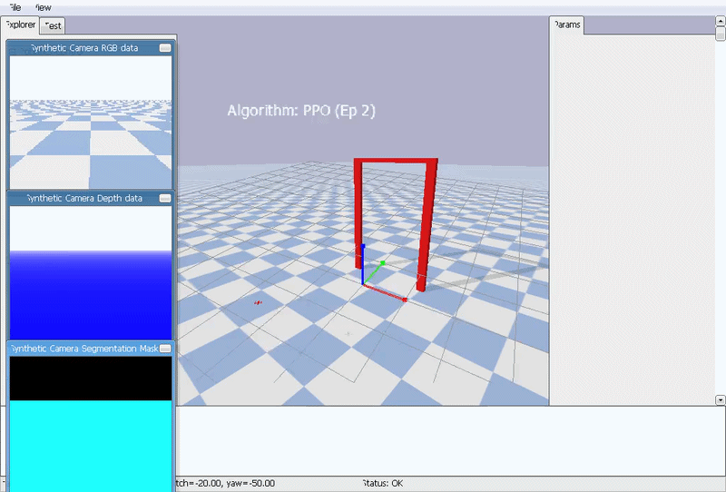
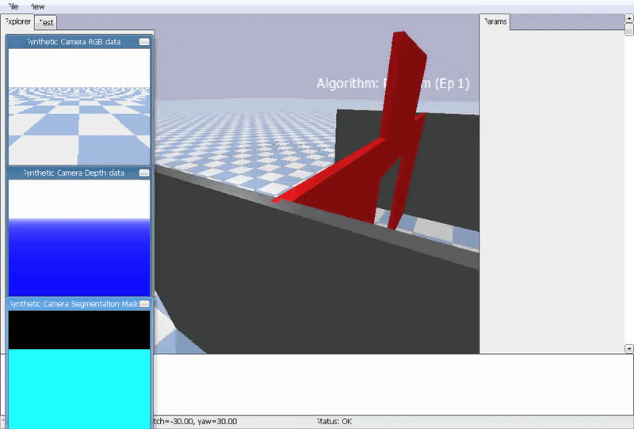
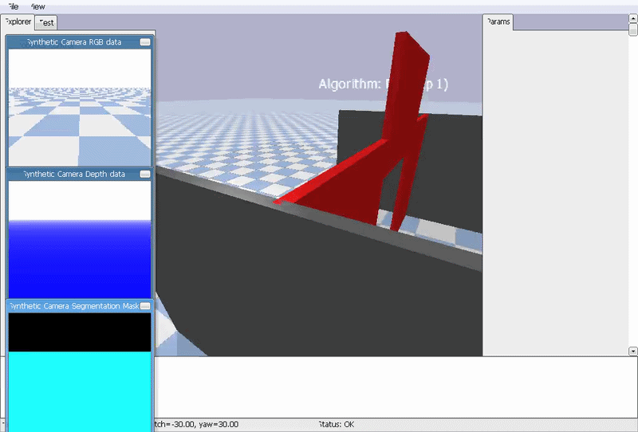
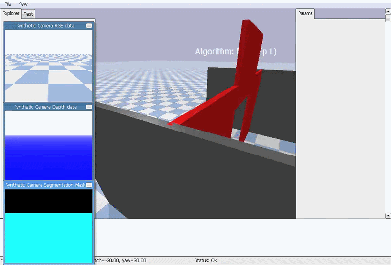

# Safe Exploration in Continuous 3D Space

**GITHUB REPO:** https://github.com/robostemic/safe-exploration-in-continuous-3d-space

## The Problem


### The Approach

[PyFlyt](https://taijunjet.com/PyFlyt/index.html) and [Gymnasium](https://gymnasium.farama.org/index.html) were used to simulate a continuous 3D environment with a single quadcopter drone for the agent and a large, red, 3D gate using the [QuadX-Hover-v4 environment](https://github.com/jjshoots/PyFlyt/blob/master/PyFlyt/gym_envs/quadx_envs/quadx_hover_env.py). Things were kept simple: The drone is enclosed on all sides by a wall (with which it can collide) and must pass through a gate to arrive at its goal.


## The Environment

The corridor is a long, narrow testing arena enclosed by 1.5 meter high grey walls and split into two by a central obstacle wall at X=1.5m. Both the corridor and wall were implemented to supply models with more information about reaching their goal and were kept the same across all trials (since the goal was navigating a specific obstacle course rather than general exploration). 

A corridor geometry was selected because it was easiest to implement given my limited experience with PyFlyt, but the reader can imagine it was selected to emulate some variety of urban or cavernous environment. 

By default, PyFlyt environments are a continuous action domain. Agents interact with flight attitude space where inputs translate to precise motor telemetry:

```
Action = [ Roll Rate, Pitch Rate, Yaw Rate, Thrust]
```

However, some of the agents required discrete values, a custom `DiscreteActionWrapper` (created with `gym.ActionWrapper`) sits between these agents and their environment. This wrapper maps a discrete space of 7 integers (0 to 6 inclusive) directly to continuous combinations.

> **0** Forward pitch with supporting thrust
>
> **1** Backward pitch with supporting thrust
>
> **2** Negative roll with supporting thrust
>
> **3** Positive roll with supporting thrust
>
> **4** Pure altitude gain
>
> **5** Pure altitude loss

This discrete wrapper was used for the Random and Deep-Q Learning agents. Random was then switched to operating off the continuous environment once it was confirmed there was no significant difference in performance across environment for Random.

### The Game Rules

#### What the drones can do

PyFlyt quadcopters have full 6-DoF rigid body physics: pitch, roll, yaw, climb, and fall. They can accelerate in any direction; this depends on the motor output. Agents in the continuous environment can move as much as they like in any direction. Discrete agents utilize a wrapper that allows them to move in discrete steps (up a certain amount, down a certain amount, left and right a certain amount).

The wall and gate frame are set up to calculate collision geometry if the drones make contact with a while.

#### What the agents can see

Agents receive a 24-element vector from PyFlyt that simulates a two-stage waypoint radar system. 

* **Index 0-11** Internal telemetry. This includes 3D positional offsets, linear velocities, angular positions (Roll/Pitch/Yaw), and angular velocities.

* **Index 12-14** Relative distance from the agent to their goalpoint (ΔX, ΔY, ΔZ); prior to crossing the gate, the goalpoing is the center of the gate at [1.5, 0.0, 1.5]; this then shidts to the final goal destination at [3.0, 0.0, 1.5] after the previous goal is reached.

* **Index 15-17** Relative distance tracking the final target location (phase 2) throughout the flight.

* **Index 18** Binary tracker: has gate been past; used to let neural networks know. 

* **Index 19-24** LiDAR ray-casting from agent to objects in the environment.

#### What the agents can't see

Since the proper GPU wasn't available, the agents weren't supplied camera input or depth pixels. PyFlyt does supply ray-casting LiDAR, so this was used instead (for index 19 through 24). 

#### The Penalties

* Drones are heavily penalized (-300.0) when they fly above the wall height (Z > 2.3) and the episode terminates immediately.

* Drones are penalized -25.0 per collision. (To prevent agents from smacking into something and getting caught, a pushback mechanic automatically resets the drone 0.2m backwards on the x).

* Missing the gate penalizes the drones with -100.0, but the drones are allowed to continue training.

* A passive -0.1 is taken from the score every simulation step (since the drones used to just hover in place forever and take their time).

#### The Rewards

* Agents receive a positive payout (distance previous - distance current x 200.0) if it reduces the 3D distance between itself and its current milestone destination (phase one / phase two).

* Agents are given 800.0 points for passing the gate. 

* Agents who pass the gate receive up to 200.0 based on how close to the horizontal center of the gate (y=0) they got. (Ie. 800.0 + (1.0-|Y_drone|) x 200.0)

* Course completion (reaching [3.0, 0.0, 1.5]) awards 1000.0.

## Meet the Agents

### Random

**Strategy** Simple. It completely ignores the environment and just does `action_space.sample()`each step. 

**Discrete/Continuous** Could use either; uses continuous in the assessment.

**Typical Use Case** Used to benchmark the other algorithms: Do they show a significant improvement compared to random chance or no? If not, the reward structure is broken.

**Strengths** Fast, unbiased

**Weaknesses** Incapable of purposeful movement, goal pursuit or hazard avoidance. 

**How it's used here** Evaluated over 3 validation episodes to establish a negative baseline score.

**Expected outcome** Failure. The agent's movement will be irratic and non-sensical. A delay was added to ensure a video recording could take place since it's assumed the random agent will die almost immediately.

### Heuristic

**Strategy:** Uses spatial telemetry and relational distance to the current goal (the heuristic) to move the agent forward. Deterministic.

**Discrete/Continuous:** Continuous.

**Typical Use Case:** Simpler automation where generalization isn't required and simple geometry can provide sufficient results.

**Strengths:** No training required; executes initially with 100% explainable behaviour and no policy variance.

**Weaknesses:** It's not actually learning or generalizing to the situation. If the wall is moved, the corridor is rotated, or flight parameters are changed, its entire functionality risks breaking down.

**How it's used here** It reads the relative distance metrics (indexes 12:15) and maps them using scale multipliers:

* pitch = dx * 0.4

* roll = dy * 0.4

* thrust = dz * 0.5

**Expected outcome** Decent performance. It receives the waypoint tracking images but doesn't have access to the LiDAR so it won't know about the wall or gate and will likely collide. Since the scene doesn't change, however, it will probably work well.

### Proximal Policy Optimizer (PPO)

[Link to Resource](https://arxiv.org/abs/1707.06347)

**Strategy** Actor-Critic system that updates its actions directly (policy) rather than just valuing them. Relies on a clipped probability ratio constraint that stops the network from updating its weights too drastically on any one training step. This means that if it receives a bad batch of data, the entire flight policy won't be damaged because of it.

**Discrete/Continuous:** Continuous

**Network Dimensions:**

__Actor__:

* Dense (256, Tanh)

* Dense (256, Tanh)

* Dense (256, Tanh)

* Output (4 continuous actions)


__Critic__:

* Dense (256, Tanh)

* Dense (256, Tanh)

* Output (1 scalar value)

**Algorithms:** Two algorithms within a single model.

* _The Actor_ Decides how to move

* _The Critic_ Evaluates how good the current position is to help scale the Actor's steps.

**Typical Use Case:** Everywhere. Robotics, video games, motion, and flight control. Most of the papers I found on it were related to how it's surprisingly good for Mult-Agent systems (which I was initially attempting to implement).

**Strengths:** Stable training mechanics that are capable of handling continuous spaces natively (no wrapper need); scales well to complex environments.

**Weaknesses:** It's an on-policy algorithm, so it discards old data immediately, meaning you need a ton of data to converge. (Also, it was a pain to set up from scratch and required a ton of dimensional trial-and-error with the PyFlyt environment.)

**How it's used here:** Aggregates flight trajectories in 2,048-step batches; updates its structural layers over 10 inner-trianing epochs. Uses a gradient clipping ceiling of 0.2

**Expected Performance:** This is the industry standard and it's built for continous settings like drone simulations. If it performs poorly, it's because the version I created from scratch is bad. Theoretically, it should stabilize itself and be able to smoothly navigate using the LiDAR ray-casts 

### Deep-Q Network (DQN)

[Link to Resource](https://arxiv.org/abs/1312.5602)

**Strategy:** Rather than predicting what action to take, this deep neural network learns the expected long-term cumulative reward of taking a specific action given a specific state--the Q-value. 

It uses epsilon-greedy as an exploitation schedule to discover high-value states.

**Discrete/Continuous:** Discrete.

**Network Dimensions** 

* Input layer (24)

* Dense (256, ReLU)

* Dense (256, ReLU)

* Output Layer (7 possible action scores)

**Algorithms** 2 networks working together.

* **Policy Q-Network** Updated every step to choose actions

* **Target Q-Network** Frozen and updated every 1,000 steps to act as a stable mathematical baseline (creates a sort of loop closure).

**Typical Use Case:** Seems to be especially common for finite systems like video games.

**Strengths:** Highly sample-efficient (due to the replay memory buffer); stable for discrete tasks

**Weaknesses:** Fundamentally incapable of handling raw, continuous spaces (hence the wrapper). Forcing a smooth, multi-variable system like a drone controller into a discrete space may have a negative impact on performance.

**How it's used here:** Learns over 150k steps via a rolling replay cache of 50,000 frames and a cycling exploration threshold (epsilon) that drops from 1.0 down to 0.05.

**Expected Performance:** Moderate performance. The DQN will have access to LiDAR data in addition to relative distance from goals, and is provided a discrete version of the controls. However, its solutions will likely be jagged and look like it's solving a gridworld problem in 3D space rather than as if it's smoothly flying.


### Deep Deterministic Policy Gradient (DDPG)

[Link to Resource](https://arxiv.org/abs/1509.02971)

**Strategy:** Off-Policy Actor-Critic algorithm designed specifically for continuous environments. From what I can understand, it's a continuous-space version of DQN. Instead of outputting a probability distribution over actions (like PPO), the DDPG's Actor network outputs a deterministic continuous action vector. It seems to use external exploration noise to discover alternate behaviours.

**Discrete/Continuous:** Continuous

**Network dimensions:**

__The Actor__ 

* Input(24)

* Dense(256, ReLU)

* Dense(256, ReLU)

* Output (4 continuous actions)

__The Critic__

* Input(24) and Action Input (4)

* Dense (256, ReLU)

* Output (1 expected value)

**Algorithms:** 4 working together.

* _The Online Actor_

* _The Target Actor_

* _The Online Critic_

* _The Target Critic_

It relies on Soft Target Updates (tau=0.005) to blend the online network weights into their target counterparts at every step.

**Typical Use Cases:** I'm not quite sure since I ran into it when DQN was given me trouble, but from what I've read, it seems to be robotics, autonomous vehicle steering, and industrial automation.

**Strengths:** Incredibly sample-efficient since it uses an off-policy experience replay cache which lets it learn from data it collected thousands of steps ago.

**Weaknesses:** Maybe it's just me, but it was a bit difficult to implement and tune; theoretically, it probably is much more impacted by bad batches of data than PPO since that data remains in its cache for ages.

**How it's used here:** Uses a 50,000 frame replay buffer, pulling in mini-batches of 128 states at every step while systematically decaying its Gaussian exploration noise scale parameter by 5% every 5,000 steps.

**Expected Outcome:** If I do this right, I feel this one should perform the best. There's no likelihood of bad batches since this is a simulation and the environment doesn't change, so this should be like cutting a daisy with a chainsaw. If I program it correctly. Which I might not.

## The Results

### Initial Run

| Agent     | Video         | Explanation               |
|-----------|---------------|---------------------------|
| Random    |  | As to be expected, random has no idea what it's doing. It not only continues to fly up but wobbles a ton as it does so. |
| Heuristic |  | This one was surprising. Heuristic just launched itself up without moving forward. It made me wonder if I programmed the goal or environment wrong. |
| PPO       |  | This one made me laugh. PPO's path is smooth--and in the direct opposite position from the goal-post. |
| DQN       |  | As expected, the DQN path is jagged. Initially, it launches itself straight up, then slowly tries to go through the goalpost--and eventually succeeds. |
| DPPG      | N/A | Not implemented this round! |

**Current Winner:** DQN performed the best of the lot. It's movements were jagged, but it was the only algorithm that successfully navigated through the goalpost.

### Mid-Run

Since the Heuristic algorithm performed so poorly, I went back and refined the environment and goal-setting. During this time, I also ran across the DDPG algorithm in a paper and wanted to try and implement/compare it with the others.

| Agent     | Video         | Explanation               |
|-----------|---------------|---------------------------|
| Random    |  | Bless its heart. The Random algorithm really tries, but it keeps just launching itself out of the simulation. The movement is still wobbly. |
| Heuristic |  | This one confused me. Heuristic now has the opposite problem as before: It just crashes. It was at this point that I started wondering if the problem was that there weren't enough obstacles to provide information. |
| PPO       |  | PPO started exploiting an error in my rewards system. I punished it too harshly for time and didn't deduct points for flying out of bounds, so it would continually fly out of bounds to maximize the score. Cheeky bugger. |
| DQN       |  | Look at him! DQN is so close, but the change in rewards made him far too cautious. Before he was zooming up and through the goal but it took him a second. Now, he's shy. Time to mess with the rewards. |
| DPPG      |  | Look at this guy go--in the exact wrong direction!! That's my fault! I realized when I was implementing it, I accidentally inverted the signs so he's doing his best to arrive in the goal and knows where it is, but I handed him inverted controls--whoops. |

**Current winner:** None; they're all struggling in their own ways. I'll give it to DQN, though, since it makes the most progress towards the goal.

### Final Run

To assist the heuristic algorithm, corridors were added around the gate. LiDAR ray-casts were also added to provide more information on the environment to the algorithms. Discrete controls were fixed, and the DDPG was un-inverted. Agents were more strongly punished for trying to sneak over the wall (I'm looking at you PPO). Goals were broken into two parts (through the gate and then to the final goal point) and agents are rewarded for how well they fly through the gate.

| Agent     | Video         | Explanation               |
|-----------|---------------|---------------------------|
| Random    |  | Still flies up at random; very poor performance. |
| Heuristic |  | Adding the corridors didn't help heuristic too much. It's still just flying up. I'll have to look again at the algorithm. |
| PPO       |  | That's interesting; PPO seems to struggle to learn how to keep the drone hovering. Either it's trying to end the session as soon as possible, or I messed up the gradient by adding the LiDAR features. |
| DQN       |  | DQN succeeds! It's able to get through the gate all right. It might cut the top a bit close, but given some more training iterations, it should be able to fly through the center of the gate. |
| DDPG      |  | Unfortunately, the DDPG seems to be trying the out of bounds exploit now. |

**Current winner:** DQN


## Discussion 

Ultimately, the DQN and DDPG algorithms seem to be the best implemented of the algorithms I tried my hand at. The heuristic algorithm--which I was sure would perform well since it's utilizing simple geometry--struggled to keep afloat (it crashed often) and would often fly out of bounds. I feel like that's got to be missing something about how PyFlyt works and borking implementation.

The DQN model never flew out of bounds. Even when it took forever, the drones would find their way to the goal--which is why I started punishing time so severely. This caused the PPO model to start exploiting the out-of-bounds hack even earlier, though. 

It's also cool to compare the movement with the Discrete DQN compared to the continuous random, heuristic, PPO, and DDPG models. It's easy to note DQN's discrete steps and understanding of its environment--especially compared with the smooth movement of the DDPG. The random movement of the random algorithm is easy to see through its wobbling, too, which is cool

I will say, PPO probably would have performed a lot better if I didn't create it from scratch. Stable Baselines 3 has a [PPO model](https://stable-baselines3.readthedocs.io/en/master/modules/ppo.html) that is pre-trained and would understand PyFlyt, the drone, and how to keep aflight better; all it would need to do is learn the enviornment. Since I implemented DQN, PPO, and DDPG from scratch, the agents had to learn about not crashing, the environment, goal navigation, LiDAR interpreation--everything--in the limited GPUs and time I had to offer them.

**As of this current run, the DQN appears to be the clear winner.** If I had to guess, the reason is related to dimensionality. PPO and DDPG are operating in a continuous environment and need to learn a lot more from it than DQN does. I'm creating a custom wrapper for DQN that acts like a binning mechanism, simplifying the task for the agent quite a bit. 

**Next steps:** Training size will be increased as will the number of episodes (perhaps 10). I'll also look over the continuous environment and double-check my implementation of the LiDAR raycasting. It's probably not a coicindence that the DDPG started to struggle after the extra dimensions were added. 

Even if I can't get PPO or DDPG through the goal in a short amount of time, I learned a ton about Reinforcement Learning and how the dimensions for models can be a bit tricky, and the pain of waiting hours for models to train, only to realize you inverted controls and your agent is now going in the exact opposite direction as the goal.

Thanks for reading through this--hope your projects were equally fun, and markedly more successful!